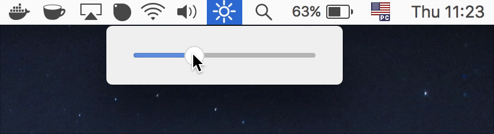

  

<h1 align="center">Menubar Brightness</h1>

  MacOS app to change the screen brightness on the menubar.

  

## Installation

[Download the latest release][latest-release] (macOS only)

## Usage

- <kbd>⌘</kbd> + <kbd>,</kbd>: to open the preferences window.
> On the preferences window you are able to specify whether Menubar Brightness will open on login or not and quit the app.

## License

MIT © [Lucas Bento][github-profile]

[latest-release]: https://github.com/lucasbento/menubar-brightness/releases/latest
[github-profile]: https://github.com/lucasbento
